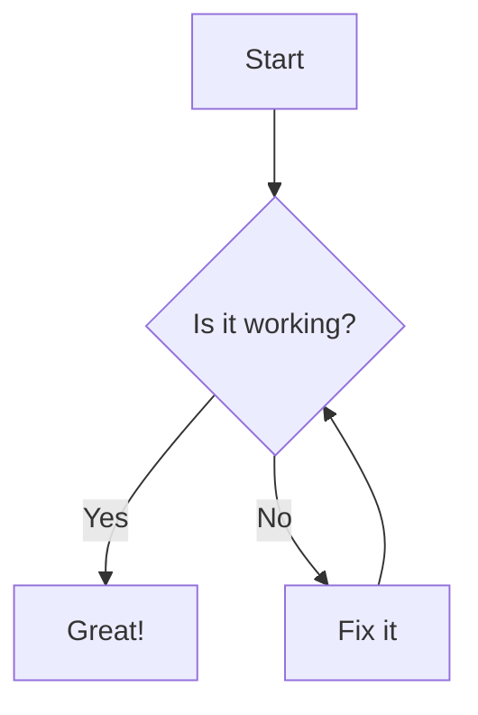

# 📝 Markdown-to-Html-Xtra

**A PowerShell script to convert Markdown into enriched, standalone HTML.**
Generate clean, styled HTML documents from `.md` files — complete with KaTeX, Mermaid, syntax highlighting, and copyable code blocks.

---

## 📚 Table of Contents

* [🌐 View Demo Output](https://bonomani.github.io/Markdown-to-Html-Xtra/readme.html)
* [📚 Key Features](#-key-features)
* [🚀 Usage](#-usage)
* [⚙️ Requirements](#-requirements)
* [📌 Lists](#-lists)
* [🔗 Links and Images](#-links-and-images)
* [📐 KaTeX Math](#-katex-math)
* [🧠 Mermaid Diagram](#-mermaid-diagram)
* [📝 Blockquote](#-blockquote)
* [✅ Task List](#-task-list)
* [🧪 Table](#-table)
* [💬 Inline Code](#-inline-code)
* [🖍 Syntax Highlighting](#-syntax-highlighting)
* [📄 Source: readme.md](#-source-readmemd)

---

## 📚 Key Features

* 🗒️ Converts **Markdown** to clean, semantic **HTML5** via **Pandoc**
* 📐 Renders **KaTeX** math (inline & block)
* 🧠 Supports **Mermaid** diagrams (flowcharts, Gantt, etc.)
* 🔁 Handles **nested code fences** and **GitHub Flavored Markdown (GFM)**
* 📋 Adds **copy-to-clipboard** buttons to code blocks
* 🖍 Enables **syntax highlighting** via **Prism.js**
* 🎨 Uses a **lightweight, responsive** GitHub-style template
* 💾 Generates **standalone HTML** (no server or internet required)
* 📥 Optional **download banner** when viewed online

---

## 🚀 Usage

```powershell
.\markdown_to_htmlx.ps1 -InputFile "example.md"
```

### Options

* `-InputFile` — Path to the `.md` file (**required**)
* `-OutputFile` — Output `.html` file name (default: input name + `.html`)
* `-TemplateFile` — Custom HTML template (default: `simple_standalone_tmpl.html`)

---

## ⚙️ Requirements

* PowerShell (Windows, macOS, or Linux)
* [Pandoc](https://pandoc.org/installing.html) — must be installed and in your system `PATH`


---


## 📌 Lists

### Unordered List

- Item 1
- Item 2
  - Subitem 2.1
  - Subitem 2.2

### Ordered List

1. First
2. Second
   1. Substep A
   2. Substep B

---

## 🔗 Links and Images

Here is a [link to OpenAI](https://openai.com).


---

## 📐 KaTeX Math

Inline math:  
Euler's identity is $e^{i\pi} + 1 = 0$.

Block math:

$$
\int_0^\infty e^{-x^2} dx = \frac{\sqrt{\pi}}{2}
$$

---

## 🧠 Mermaid Diagram



---

## 📝 Blockquote

> "Markdown is easy to read and write."
> — *Some Developer*

---

## ✅ Task List

* [x] Understand Markdown
* [x] Render KaTeX
* [x] Use Mermaid
* [ ] Profit

---

## 🧪 Table

| Syntax | Description |
| ------ | ----------- |
| Header | Title       |
| Cell   | Text        |

---

## 💬 Inline Code

Use `print()` in Python to output text.

---

## 🖍 Syntax Highlighting

### 🔧 Bash

```bash
#!/bin/bash
echo "Hello, world!"
if [ "$1" == "test" ]; then
  echo "Testing mode"
fi
```

### 🗂 JSON

```json
{
  "name": "example",
  "version": "1.0.0",
  "dependencies": {
    "prismjs": "^1.29.0"
  }
}
```

### 🐍 Python

```python
def factorial(n):
    return 1 if n == 0 else n * factorial(n - 1)

print(factorial(5))
```

### 📜 JavaScript

```javascript
function greet(name) {
  console.log(`Hello, ${name}!`);
}

greet("Markdown");
```

### ✍️ Markdown

````markdown
# Hello Markdown

- List item 1
- List item 2

**Bold text** and *italic text*

```python
print("This is a nested code block.")
```

````

### 🧾 YAML

```yaml
version: "3"
services:
  web:
    image: nginx:latest
    ports:
      - "80:80"
```

### ⚡ PowerShell

```powershell
param (
  [string]$Name = "World"
)

Write-Host "Hello, $Name!"
```

---

### 📄 Source: readme.md

`````markdown
# 📝 Markdown-to-Html-Xtra

**A PowerShell script to convert Markdown into enriched, standalone HTML.**
Generate clean, styled HTML documents from `.md` files — complete with KaTeX, Mermaid, syntax highlighting, and copyable code blocks.

---

## 📚 Table of Contents

* [📚 Key Features](#-key-features)
* [🚀 Usage](#-usage)
* [⚙️ Requirements](#-requirements)
* [📌 Lists](#-lists)
* [🔗 Links and Images](#-links-and-images)
* [📐 KaTeX Math](#-katex-math)
* [🧠 Mermaid Diagram](#-mermaid-diagram)
* [📝 Blockquote](#-blockquote)
* [✅ Task List](#-task-list)
* [🧪 Table](#-table)
* [💬 Inline Code](#-inline-code)
* [🖍 Syntax Highlighting](#-syntax-highlighting)
* [📄 Source: readme.md](#-source-readmemd)

---

## 📚 Key Features

* 🗒️ Converts **Markdown** to clean, semantic **HTML5** via **Pandoc**
* 📐 Renders **KaTeX** math (inline & block)
* 🧠 Supports **Mermaid** diagrams (flowcharts, Gantt, etc.)
* 🔁 Handles **nested code fences** and **GitHub Flavored Markdown (GFM)**
* 📋 Adds **copy-to-clipboard** buttons to code blocks
* 🖍 Enables **syntax highlighting** via **Prism.js**
* 🎨 Uses a **lightweight, responsive** GitHub-style template
* 💾 Generates **standalone HTML** (no server or internet required)
* 📥 Optional **download banner** when viewed online

---

## 🚀 Usage

```powershell
.\markdown_to_htmlx.ps1 -InputFile "example.md"
```

### Options

* `-InputFile` — Path to the `.md` file (**required**)
* `-OutputFile` — Output `.html` file name (default: input name + `.html`)
* `-TemplateFile` — Custom HTML template (default: `simple_standalone_tmpl.html`)

---

## ⚙️ Requirements

* PowerShell (Windows, macOS, or Linux)
* [Pandoc](https://pandoc.org/installing.html) — must be installed and in your system `PATH`


---


## 📌 Lists

### Unordered List

- Item 1
- Item 2
  - Subitem 2.1
  - Subitem 2.2

### Ordered List

1. First
2. Second
   1. Substep A
   2. Substep B

---

## 🔗 Links and Images

Here is a [link to OpenAI](https://openai.com).


---

## 📐 KaTeX Math

Inline math:  
Euler's identity is $e^{i\pi} + 1 = 0$.

Block math:

$$
\int_0^\infty e^{-x^2} dx = \frac{\sqrt{\pi}}{2}
$$

---

## 🧠 Mermaid Diagram


---

## 📝 Blockquote

> "Markdown is easy to read and write."
> — *Some Developer*

---

## ✅ Task List

* [x] Understand Markdown
* [x] Render KaTeX
* [x] Use Mermaid
* [ ] Profit

---

## 🧪 Table

| Syntax | Description |
| ------ | ----------- |
| Header | Title       |
| Cell   | Text        |

---

## 💬 Inline Code

Use `print()` in Python to output text.

---

## 🖍 Syntax Highlighting

### 🔧 Bash

```bash
#!/bin/bash
echo "Hello, world!"
if [ "$1" == "test" ]; then
  echo "Testing mode"
fi
```

### 🗂 JSON

```json
{
  "name": "example",
  "version": "1.0.0",
  "dependencies": {
    "prismjs": "^1.29.0"
  }
}
```

### 🐍 Python

```python
def factorial(n):
    return 1 if n == 0 else n * factorial(n - 1)

print(factorial(5))
```

### 📜 JavaScript

```javascript
function greet(name) {
  console.log(`Hello, ${name}!`);
}

greet("Markdown");
```

### ✍️ Markdown

````markdown
# Hello Markdown

- List item 1
- List item 2

**Bold text** and *italic text*

```python
print("This is a nested code block.")
```

````

### 🧾 YAML

```yaml
version: "3"
services:
  web:
    image: nginx:latest
    ports:
      - "80:80"
```

### ⚡ PowerShell

```powershell
param (
  [string]$Name = "World"
)

Write-Host "Hello, $Name!"
```
`````

